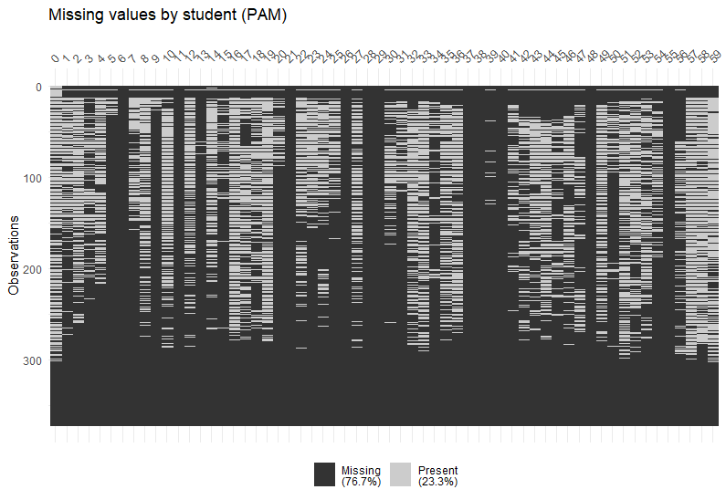
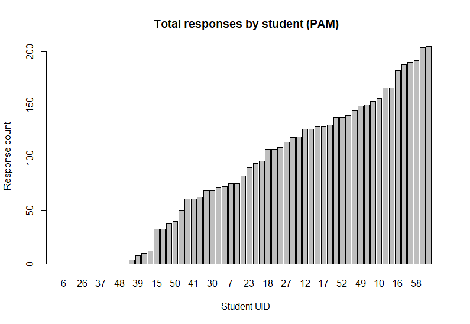

studentlife: Tidy Handling and Navigation of a Valuable Mobile-Health Dataset
======================================================================================================


<!-- Badges Start -->
[](https://CRAN.R-project.org/package=studentlife)
[](https://github.com/frycast/studentlife)
[](https://CRAN.R-project.org/package=studentlife)
[](https://travis-ci.org/frycast/studentlife) 
[](https://mybinder.org/v2/gh/frycast/studentlife/master?urlpath=rstudio) 
[](https://www.gnu.org/licenses/gpl-3.0) 
[](https://codecov.io/github/frycast/studentlife?branch=master)
[](https://www.tidyverse.org/lifecycle/)
[](https://doi.org/10.5281/zenodo.3371922)
<!-- Badges End -->

This package is [available on CRAN](https://cran.r-project.org/web/packages/studentlife/index.html).

Use this R package to download, navigate and analyse the Student-Life dataset. The Student-Life dataset contains 
    passive and automatic sensing data from the phones of a class 
    of 48 de-identified Dartmouth college students. It was collected 
    over a 10 week term. Additionally, the dataset contains Ecological 
    Momentary Assessment results along with pre- and post-study mental 
    health surveys, such as the PHQ-9. The intended use is to allow
    researchers and other interested people to assess 
    mental health, academic performance and behavioral trends. 
    The raw dataset and additional information is available at <https://studentlife.cs.dartmouth.edu/>.


Installation
------------

``` r
## Uncomment to install the package from CRAN
# install.packages("studentlife")

## Or, uncomment to install the package from GitHub
# install.packages("devtools")
# devtools::install_github("frycast/studentlife")
```

This studentlife repository includes a small sample dataset that can be used for practice and testing. You can download the sample data within R:
```
library(studentlife)
d <- tempdir()
download_studentlife(location = d, url = "testdata")
```

This README will use the studentlife data in its original format. 
Details on the full original dataset are available [here](https://studentlife.cs.dartmouth.edu).
However, an RData version of the dataset has been hosted on Zenodo as of 09/11/2019 [here](https://zenodo.org/record/3529253).
To download and use this RData version (which is faster to read and takes up less space):

```r
d <- tempdir()
download_studentlife(location = d, url = "rdata")

# Choose the schema and table from the list SL_tables:
SL_tables

# Example with activity table from sensing schema
schema <- "sensing"
table <- "activity"
act <- readRDS(paste0(d, "/dataset_rds/", schema, "/", table, ".Rds"))
act
```

In this README we will use the full dataset rather than just the sample data. The download size is 5 GB.

``` r
download_studentlife(location = d)
```

Use the interactive menu to browse the tables and schemas of the downloaded dataset:

``` r
tab <- studentlife::load_SL_tibble(location = d)
```

The object returned by the above function is called a
'StudentLife tibble' (or `SL_tbl`).
Restrictions can be placed on the menu options with `time_options`:

``` r
tab_t <- load_SL_tibble(location = d, time_options = "timestamp", csv_nrows = 10)
tab_p <- load_SL_tibble(location = d, time_options = "interval" , csv_nrows = 10)
tab_d <- load_SL_tibble(location = d, time_options = "dateonly" , csv_nrows = 10)
tab_s <- load_SL_tibble(location = d, time_options = "dateless" , csv_nrows = 10)
```

The `regularise_time` function can be used to summarise information within blocks of time,
producing an object called a 'regularised StudentLife tibble' (or `reg_SL_tbl`):

``` r
tab <- load_SL_tibble(
  loc = d, schema = "sensing", table = "activity", csv_nrows = 10)
  
regularise_time(
  tab, blocks = c("day","weekday"),
  act_inf = max(activity_inference), add_NAs = FALSE)
```

Produce a histogram showing PAM EMA response frequencies over the course of the study:

``` r
tab_PAM <- load_SL_tibble(schema = "EMA", table = "PAM", location = d)
response_hour_hist(tab_PAM, break_hours = 10)
```


A summary will produce details such as EMA question, UIDs of 
dropped students, schema name, table name, and summary statistics.

```r
summary(tab_PAM)
```

``` 
EMA_questions 
 Refer to: Pollak, J. P., Adams, P., & Gay, G. (2011, May). 
 PAM: a photographic affect meter for frequent, in situ measurement of affect. 
 In Proceedings of the SIGCHI conference on Human factors in computing systems 
 (pp. 725-734). ACM. 

dropped_students 
 None 

column_names 
 picture_idx timestamp uid 

schema 
 EMA 

table 
 PAM 

Skim summary statistics
 n obs: 9040 
 n variables: 3 

-- Variable type:factor --------------------------------------------------------
 variable missing complete    n n_unique                        top_counts ordered
      uid       0     9040 9040       49 59: 437, 0: 390, 19: 384, 57: 377   FALSE

-- Variable type:numeric -------------------------------------------------------
    variable missing complete    n    mean         sd      p0     p25     p50      p75     p100
 picture_idx       0     9040 9040 8.85          4.17 1       6       8       12       16      
   timestamp       0     9040 9040 1.4e+09 1608614.45 1.4e+09 1.4e+09 1.4e+09  1.4e+09  1.4e+09
     hist
 ▂▃▆▇▃▆▅▅
 ▇▇▆▅▃▁▁▁
```

After regularising a StudentLife tibble, we can visualise the 
missing values in each block for each student:

```r
reg_PAM <- regularise_time(tab_PAM, blocks = c("day", "epoch"), m = mean(picture_idx, na.rm = TRUE))
vis_NAs(reg_PAM, response = "m")
```


We can also visualise and compare the total number of responses 
received from each student over the course of the study:

```r
vis_response_counts(reg_PAM, response = "m")
```




Summaries of survey data are formatted with question information and some answer statistics:

```r 
tab_PHQ9 <- load_SL_tibble(loc = d, schema = "survey", table = "PHQ-9")
summary(tab_PHQ9)
```

```
time_info 
 none 

survey_questions 
 Q1: Little interest or pleasure in doing things
 Q2: Feeling down, depressed, hopeless.
 Q3: Trouble falling or staying asleep, or sleeping too much.
 Q4: Feeling tired or having little energy
 Q5: Poor appetite or overeating
 Q6: Feeling bad about yourself or that you are a failure or have let yourself or your family down
 Q7: Trouble concentrating on things, such as reading the newspaper or watching television
 Q8: Moving or speaking so slowly that other people could have noticed. Or the opposite being so figety or restless that you have been moving around a lot more than usual
 Q9: Thoughts that you would be better off dead, or of hurting yourself
 Q10: Response
 

column_names 
 uid type Q1 Q2 Q3 Q4 Q5 Q6 Q7 Q8 Q9 Q10 

schema 
 survey 

table 
 PHQ-9 

skim 
Skim summary statistics
 n obs: 84 
 n variables: 12 

-- Variable type:factor --------------------------------------------------------
 variable missing complete  n n_unique                        top_counts ordered
       Q1       0       84 84        4 Not: 42, Sev: 28, Mor: 10, Nea: 4   FALSE
      Q10       5       79 84        4   Som: 37, Not: 36, NA: 5, Ext: 3   FALSE
       Q2       0       84 84        4  Not: 40, Sev: 34, Mor: 6, Nea: 4   FALSE
       Q3       0       84 84        4 Not: 41, Sev: 25, Mor: 10, Nea: 8   FALSE
       Q4       0       84 84        4 Sev: 38, Not: 23, Mor: 17, Nea: 6   FALSE
       Q5       0       84 84        4  Sev: 35, Not: 34, Mor: 9, Nea: 6   FALSE
       Q6       0       84 84        4  Not: 45, Sev: 27, Mor: 6, Nea: 6   FALSE
       Q7       0       84 84        4  Not: 48, Sev: 26, Mor: 7, Nea: 3   FALSE
       Q8       0       84 84        4  Not: 64, Sev: 15, Mor: 4, Nea: 1   FALSE
       Q9       0       84 84        3    Not: 75, Sev: 6, Mor: 3, NA: 0   FALSE
     type       0       84 84        2           pre: 46, pos: 38, NA: 0   FALSE
      uid       0       84 84       46            0: 2, 1: 2, 2: 2, 3: 2   FALSE
```


Software Testing
----------------

This studentlife repository includes many automated software tests implemented via [`testthat`](https://cran.r-project.org/web/packages/testthat/index.html). We use these to check for bugs before releasing new updates. They can be found under the directory `tests`. Also, we use [Travis-CI](https://travis-ci.org/frycast/studentlife) for continuous integration.

Community Guidelines
----------------
* Please give your feedback and report bugs at the [issues page](https://github.com/frycast/studentlife/issues).
* Contributions are welcome! The best way to contribute is to fork the project on GitHub, make a contribution to your fork, and then submit a pull request. A useful guide can be [found here](https://akrabat.com/the-beginners-guide-to-contributing-to-a-github-project/#summary).
* If you have questions or need support please email Daniel Fryer via the email on his [GitHub profile](https://github.com/frycast/).


<!--
DOCUMENTATION CHECKLIST
    A statement of need: Do the authors clearly state what problems the software is designed to solve and who the target audience is?
    Installation instructions: Is there a clearly-stated list of dependencies? Ideally these should be handled with an automated package management solution.
    Example usage: Do the authors include examples of how to use the software (ideally to solve real-world analysis problems).
    Functionality documentation: Is the core functionality of the software documented to a satisfactory level (e.g., API method documentation)?
    Automated tests: Are there automated tests or manual steps described so that the function of the software can be verified?
    Community guidelines: Are there clear guidelines for third parties wishing to 1) Contribute to the software 2) Report issues or problems with the software 3) Seek support
A statement of need
The authors should clearly state what problems the software is designed to solve and who the target audience is.
Installation instructions
There should be a clearly-stated list of dependencies. Ideally these should be handled with an automated package management solution.
    Good: A package management file such as a Gemfile or package.json or equivalent
    OK: A list of dependencies to install
    Bad (not acceptable): Reliance on other software not listed by the authors
Example usage
The authors should include examples of how to use the software (ideally to solve real-world analysis problems).
API documentation
Reviewers should check that the software API is documented to a suitable level.
    Good: All functions/methods are documented including example inputs and outputs
    OK: Core API functionality is documented
    Bad (not acceptable): API is undocumented
    
Community guidelines
There should be clear guidelines for third-parties wishing to:
    Contribute to the software
    Report issues or problems with the software
    Seek support
Functionality
Reviewers are expected to install the software they are reviewing and to verify the core functionality of the software.
Tests
Authors are strongly encouraged to include an automated test suite covering the core functionality of their software.
    Good: An automated test suite hooked up to an external service such as Travis-CI or similar
    OK: Documented manual steps that can be followed to objectively check the expected functionality of the software (e.g. a sample input file to assert behaviour)
    Bad (not acceptable): No way for you the reviewer to objectively assess whether the software works
-->


